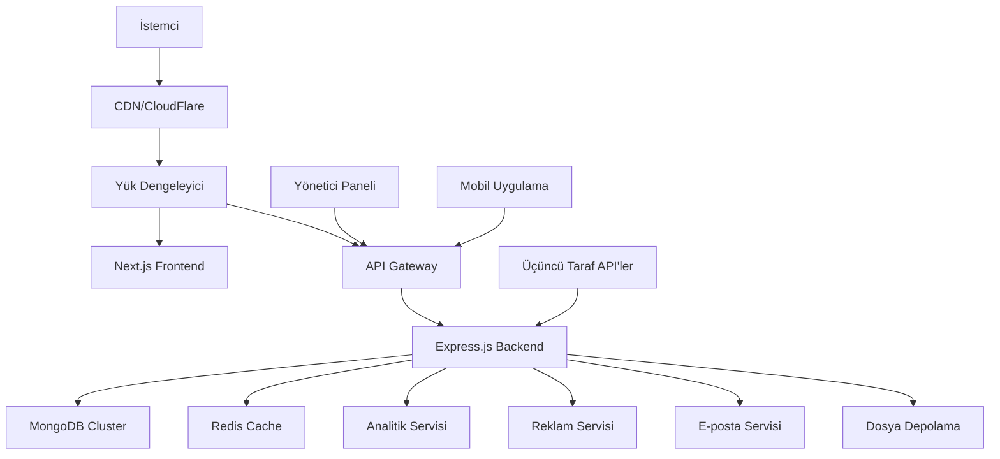

# 🔗 ShortLink Pro - Gelişmiş URL Kısaltma ve Monetizasyon Platformu

[](https://opensource.org/licenses/MIT)
[](https://nodejs.org/)
[](https://nextjs.org/)
[](https://www.mongodb.com/)

> **Kurumsal seviyede URL kısaltma platformu - gelişmiş analitik, monetizasyon özellikleri ve kapsamlı yönetici kontrolleri ile.**

## 📋 İçindekiler

- [Genel Bakış](#-genel-bakış)
- [Temel Özellikler](#-temel-özellikler)
- [Mimari](#-mimari)
- [Teknoloji Yığını](#-teknoloji-yığını)
- [Proje Yapısı](#-proje-yapısı)
- [API Dokümantasyonu](#-api-dokümantasyonu)
- [Kurulum ve Ayarlar](#-kurulum-ve-ayarlar)
- [Konfigürasyon](#-konfigürasyon)
- [Deployment](#-deployment)
- [Güvenlik](#-güvenlik)
- [Katkıda Bulunma](#-katkıda-bulunma)
- [Lisans](#-lisans)

## 🎯 Genel Bakış

ShortLink Pro, kurumsal kullanım için tasarlanmış kapsamlı bir URL kısaltma ve monetizasyon platformudur. Gelişmiş analitik, kullanıcı yönetimi ve stratejik reklam yerleşimleri ile gelir üretimini birleştirir. Platform hem URL'lerini kısaltmak isteyen son kullanıcılara hem de detaylı içgörüler ve kontrol ihtiyacı olan yöneticilere hizmet verir.

### Temel Değer Önerileri
- **Monetizasyon**: Ara reklamlar ve premium özellikler aracılığıyla gelir üretimi
- **Analitik**: Detaylı kullanıcı davranış içgörüleri ile kapsamlı tıklama takibi
- **Ölçeklenebilirlik**: Milyonlarca URL ve tıklamayı işleyecek şekilde inşa edilmiş
- **Güvenlik**: Bot koruması ve zararlı URL tespiti ile kurumsal seviyede güvenlik
- **Özelleştirme**: Özelleştirilebilir markalama ile beyaz etiket çözümü

## ✨ Temel Özellikler

### 🌐 Frontend (Next.js 13+)
- **Modern UI/UX**: Tailwind CSS ve Framer Motion ile responsive tasarım
- **Kullanıcı Paneli**: 
  - İnteraktif grafiklerle gerçek zamanlı analitik
  - Toplu işlemlerle link yönetimi
  - Gelir takibi ve ödeme geçmişi
  - Özel markalama seçenekleri
- **Yönetici Paneli**:
  - Kullanıcı yönetimi ve rol tabanlı erişim kontrolü
  - Sistem geneli analitik ve raporlama
  - Gelir yönetimi ve ödeme işleme
  - İçerik moderasyon araçları
- **Landing Sayfaları**: SEO optimize edilmiş pazarlama sayfaları
- **Mobil Uygulama**: React Native eşlik uygulaması (planlanan)

### ⚙️ Backend (Node.js + Express)
- **Yüksek Performanslı API**: GraphQL desteği ile RESTful API
- **Gelişmiş Analitik**: 
  - Gerçek zamanlı tıklama takibi
  - Coğrafi ve cihaz analitikleri
  - Referrer analizi
  - Dönüşüm takibi
- **Monetizasyon Motoru**:
  - Dinamik reklam yerleştirme algoritmaları
  - Gelir optimizasyonu
  - Reklam performansı için A/B testi
- **Güvenlik Özellikleri**:
  - Hız sınırlama ve DDoS koruması
  - Zararlı URL tespiti
  - Bot trafik filtreleme
  - GDPR uyumluluk araçları

### 📊 Analitik ve Raporlama
- **Gerçek Zamanlı Dashboard**: Canlı istatistikler ve performans metrikleri
- **Özel Raporlar**: Çoklu formatta dışa aktarılabilir analitik
- **API Analitik**: API kullanımı ve performans takibi
- **Gelir Analitik**: Detaylı finansal raporlama ve tahminleme

## 🏗 Mimari



## 🛠 Teknoloji Yığını

### Frontend
- **Framework**: Next.js 13+ (App Router)
- **Stil**: Tailwind CSS + Headless UI
- **Durum Yönetimi**: Zustand + React Query
- **Grafikler**: Recharts + D3.js
- **Animasyonlar**: Framer Motion
- **Test**: Jest + React Testing Library
- **Tip Güvenliği**: TypeScript

### Backend
- **Runtime**: Node.js 18+
- **Framework**: TypeScript ile Express.js
- **Veritabanı**: Mongoose ODM ile MongoDB 5.0+
- **Önbellekleme**: Redis 6+
- **Kimlik Doğrulama**: JWT + Yenileme Tokenları
- **Doğrulama**: Joi + Express Validator
- **Test**: Jest + Supertest
- **Dokümantasyon**: Swagger/OpenAPI

### Altyapı
- **Konteynerleştirme**: Docker + Docker Compose
- **Orkestrasyon**: Kubernetes (üretim)
- **CDN**: CloudFlare
- **İzleme**: Prometheus + Grafana
- **Loglama**: Winston + ELK Stack
- **CI/CD**: GitHub Actions

### Üçüncü Taraf Servisler
- **E-posta**: SendGrid / AWS SES
- **Dosya Depolama**: AWS S3 / CloudFlare R2
- **Analitik**: Google Analytics 4
- **Güvenlik**: Google Safe Browsing API
- **Ödemeler**: Stripe / PayPal

## 📂 Proje Yapısı

```
short-link/
├── 📁 web/                          # Next.js Frontend
│   ├── 📁 app/                      # App Router (Next.js 13+)
│   │   ├── 📁 (auth)/               # Kimlik doğrulama route grubu
│   │   ├── 📁 dashboard/            # Kullanıcı paneli
│   │   ├── 📁 admin/                # Yönetici paneli
│   │   └── 📁 api/                  # API route'ları
│   ├── 📁 components/               # Yeniden kullanılabilir bileşenler
│   │   ├── 📁 ui/                   # Temel UI bileşenleri
│   │   ├── 📁 forms/                # Form bileşenleri
│   │   ├── 📁 charts/               # Grafik bileşenleri
│   │   └── 📁 layout/               # Layout bileşenleri
│   ├── 📁 lib/                      # Yardımcı fonksiyonlar ve konfigürasyonlar
│   ├── 📁 hooks/                    # Özel React hook'ları
│   ├── 📁 store/                    # Durum yönetimi
│   └── 📁 types/                    # TypeScript tip tanımları
│
├── 📁 backend/                      # Node.js Backend
│   ├── 📁 src/
│   │   ├── 📁 controllers/          # Route kontrolcüleri
│   │   ├── 📁 middleware/           # Express middleware
│   │   ├── 📁 models/               # Mongoose modelleri
│   │   ├── 📁 routes/               # API route'ları
│   │   ├── 📁 services/             # İş mantığı
│   │   ├── 📁 utils/                # Yardımcı fonksiyonlar
│   │   ├── 📁 config/               # Konfigürasyon dosyaları
│   │   └── 📁 types/                # TypeScript tipleri
│   ├── 📁 tests/                    # Test dosyaları
│   └── 📁 docs/                     # API dokümantasyonu
│
├── 📁 shared/                       # Frontend/backend arası paylaşılan kod
│   ├── 📁 types/                    # Paylaşılan TypeScript tipleri
│   ├── 📁 utils/                    # Paylaşılan yardımcı fonksiyonlar
│   └── 📁 constants/                # Paylaşılan sabitler
│
├── 📁 infrastructure/               # Altyapı Kodu
│   ├── 📁 docker/                   # Docker konfigürasyonları
│   ├── 📁 k8s/                      # Kubernetes manifestleri
│   └── 📁 terraform/                # Terraform konfigürasyonları
│
├── 📁 docs/                         # Dokümantasyon
│   ├── 📁 api/                      # API dokümantasyonu
│   ├── 📁 deployment/               # Deployment rehberleri
│   └── 📁 architecture/             # Mimari dokümantasyonu
│
├── 📄 docker-compose.yml            # Geliştirme ortamı
├── 📄 package.json                  # Root package.json
├── 📄 .env.example                  # Ortam değişkenleri şablonu
└── 📄 README.md                     # Bu dosya
```

## 📚 API Dokümantasyonu

### Kimlik Doğrulama Endpoint'leri
```http
POST   /api/auth/register           # Kullanıcı kaydı
POST   /api/auth/login              # Kullanıcı girişi
POST   /api/auth/refresh            # JWT token yenileme
POST   /api/auth/logout             # Kullanıcı çıkışı
POST   /api/auth/forgot-password    # Şifre sıfırlama talebi
POST   /api/auth/reset-password     # Şifre sıfırlama onayı
```

### Link Yönetimi
```http
GET    /api/links                   # Kullanıcının linklerini getir (sayfalanmış)
POST   /api/links                   # Yeni kısa link oluştur
GET    /api/links/:id               # Link detaylarını getir
PUT    /api/links/:id               # Link güncelle
DELETE /api/links/:id               # Link sil
POST   /api/links/bulk              # Toplu işlemler
```

### Analitik
```http
GET    /api/analytics/links/:id     # Link özel analitik
GET    /api/analytics/overview      # Kullanıcı genel bakış analitik
GET    /api/analytics/export        # Analitik verilerini dışa aktar
```

### Yönetici Endpoint'leri
```http
GET    /api/admin/users             # Tüm kullanıcıları getir
GET    /api/admin/stats             # Sistem istatistikleri
GET    /api/admin/revenue           # Gelir analitik
POST   /api/admin/users/:id/ban     # Kullanıcıyı yasakla/yasağı kaldır
```

### Genel Endpoint'ler
```http
GET    /:code                       # Orijinal URL'ye yönlendir
GET    /api/health                  # Sağlık kontrolü
```

## 🚀 Kurulum ve Ayarlar

### Ön Gereksinimler
- Node.js 18+ 
- MongoDB 5.0+
- Redis 6+
- Docker (opsiyonel)

### Hızlı Başlangıç

1. **Depoyu klonlayın**
```bash
git clone https://github.com/your-username/short-link-pro.git
cd short-link-pro
```

2. **Bağımlılıkları yükleyin**
```bash
# Root bağımlılıkları yükle
npm install

# Frontend bağımlılıklarını yükle
cd web && npm install

# Backend bağımlılıklarını yükle
cd ../backend && npm install
```

3. **Ortam Ayarları**
```bash
# Ortam dosyalarını kopyala
cp .env.example .env
cp web/.env.example web/.env.local
cp backend/.env.example backend/.env
```

4. **Veritabanı Kurulumu**
```bash
# MongoDB ve Redis'i başlat (Docker kullanarak)
docker-compose up -d mongodb redis

# Veya yerel olarak başlat
# mongod --dbpath /path/to/your/db
# redis-server
```

5. **Geliştirme Sunucularını Çalıştır**
```bash
# Terminal 1: Backend
cd backend && npm run dev

# Terminal 2: Frontend  
cd web && npm run dev
```

6. **Uygulamaya Erişim**
- Frontend: http://localhost:3000
- Backend API: http://localhost:5000
- API Dokümantasyonu: http://localhost:5000/api-docs

### Üretim Kurulumu

Detaylı üretim kurulum talimatları için [Deployment Rehberi](docs/deployment/README.md) bölümüne bakın.

## ⚙️ Konfigürasyon

### Ortam Değişkenleri

#### Backend (.env)
```env
# Sunucu Konfigürasyonu
NODE_ENV=production
PORT=5000
HOST=0.0.0.0

# Veritabanı
MONGODB_URI=mongodb://localhost:27017/shortlink-pro
REDIS_URL=redis://localhost:6379

# JWT Konfigürasyonu
JWT_SECRET=your-super-secret-jwt-key
JWT_REFRESH_SECRET=your-refresh-secret
JWT_EXPIRES_IN=15m
JWT_REFRESH_EXPIRES_IN=7d

# Dış Servisler
SENDGRID_API_KEY=your-sendgrid-key
AWS_ACCESS_KEY_ID=your-aws-key
AWS_SECRET_ACCESS_KEY=your-aws-secret
AWS_S3_BUCKET=your-bucket-name

# Güvenlik
BCRYPT_ROUNDS=12
RATE_LIMIT_WINDOW_MS=900000
RATE_LIMIT_MAX_REQUESTS=100

# Analitik
GOOGLE_ANALYTICS_ID=GA-XXXXXXXXX
GOOGLE_SAFE_BROWSING_API_KEY=your-api-key
```

#### Frontend (.env.local)
```env
API_URL=http://localhost:5000
APP_URL=http://localhost:3000
GOOGLE_ANALYTICS_ID=GA-XXXXXXXXX
```

## 🚀 Deployment

### Docker Deployment
```bash
# Docker Compose ile build ve çalıştır
docker-compose -f docker-compose.prod.yml up -d
```

### Kubernetes Deployment
```bash
# Kubernetes manifestlerini uygula
kubectl apply -f infrastructure/k8s/
```

### Manuel Deployment
Adım adım talimatlar için [Deployment Rehberi](docs/deployment/README.md) bölümüne bakın.

## 🔒 Güvenlik

### Güvenlik Özellikleri
- **Kimlik Doğrulama**: Yenileme token rotasyonu ile JWT
- **Yetkilendirme**: Rol tabanlı erişim kontrolü (RBAC)
- **Girdi Doğrulama**: Kapsamlı girdi temizleme
- **Hız Sınırlama**: DDoS koruması ve kötüye kullanım önleme
- **CORS**: Yapılandırılabilir çapraz kaynak paylaşımı
- **Helmet**: Güvenlik başlıkları middleware
- **CSRF Koruması**: Çapraz site istek sahteciliği önleme
- **SQL Injection**: MongoDB injection önleme
- **XSS Koruması**: Çapraz site komut dosyası önleme

### Güvenlik En İyi Uygulamaları
- Düzenli güvenlik denetimleri
- Bağımlılık güvenlik açığı taraması
- Otomatik güvenlik testleri
- Güvenli kodlama yönergeleri
- Olay müdahale prosedürleri

## 🤝 Katkıda Bulunma

Katkılarınızı memnuniyetle karşılıyoruz! Detaylar için [Katkıda Bulunma Rehberi](CONTRIBUTING.md) bölümüne bakın.

### Geliştirme İş Akışı
1. Depoyu fork edin
2. Bir özellik dalı oluşturun (`git checkout -b feature/amazing-feature`)
3. Değişikliklerinizi commit edin (`git commit -m 'Add amazing feature'`)
4. Dalı push edin (`git push origin feature/amazing-feature`)
5. Bir Pull Request açın

### Kod Standartları
- ESLint ve Prettier konfigürasyonlarını takip edin
- Kapsamlı testler yazın
- Dokümantasyonu güncelleyin
- Konvansiyonel commit mesajlarını takip edin

## 📄 Lisans

Bu proje MIT Lisansı altında lisanslanmıştır - detaylar için [LICENSE](LICENSE) dosyasına bakın.

## 📞 Destek

- **Dokümantasyon**: [docs.shortlinkpro.com](https://docs.shortlinkpro.com)
- **Sorunlar**: [GitHub Issues](https://github.com/your-username/short-link-pro/issues)
- **Tartışmalar**: [GitHub Discussions](https://github.com/your-username/short-link-pro/discussions)
- **E-posta**: support@shortlinkpro.com

---

<div align="center">
  <p>ShortLink Pro Ekibi tarafından ❤️ ile yapıldı</p>
  <p>
    <a href="#-genel-bakış">Genel Bakış</a> •
    <a href="#-temel-özellikler">Özellikler</a> •
    <a href="#-kurulum-ve-ayarlar">Kurulum</a> •
    <a href="#-api-dokümantasyonu">API</a> •
    <a href="#-deployment">Deployment</a>
  </p>
</div>